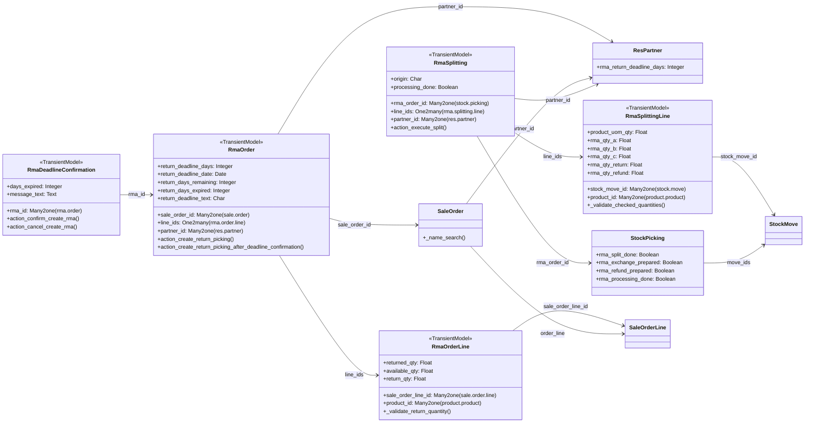

# RMA Management Klassendiagramm

```mermaid
classDiagram
direction LR

class RmaOrder {
    <<TransientModel>>
    +sale_order_id: Many2one(sale.order)
    +line_ids: One2many(rma.order.line)
    +partner_id: Many2one(res.partner)
    +return_deadline_days: Integer
    +return_deadline_date: Date
    +return_days_remaining: Integer
    +return_days_expired: Integer
    +return_deadline_text: Char
    +action_create_return_picking()
    +action_create_return_picking_after_deadline_confirmation()
}

class SaleOrder {
    +_name_search()
}

class RmaOrderLine {
    <<TransientModel>>
    +sale_order_line_id: Many2one(sale.order.line)
    +product_id: Many2one(product.product)
    +returned_qty: Float
    +available_qty: Float
    +return_qty: Float
    +_validate_return_quantity()
}

class ResPartner {
    +rma_return_deadline_days: Integer
}

class RmaDeadlineConfirmation {
    <<TransientModel>>
    +rma_id: Many2one(rma.order)
    +days_expired: Integer
    +message_text: Text
    +action_confirm_create_rma()
    +action_cancel_create_rma()
}

class RmaSplitting {
    <<TransientModel>>
    +rma_order_id: Many2one(stock.picking)
    +line_ids: One2many(rma.splitting.line)
    +partner_id: Many2one(res.partner)
    +origin: Char
    +processing_done: Boolean
    +action_execute_split()
}

class RmaSplittingLine {
    <<TransientModel>>
    +stock_move_id: Many2one(stock.move)
    +product_id: Many2one(product.product)
    +product_uom_qty: Float
    +rma_qty_a: Float
    +rma_qty_b: Float
    +rma_qty_c: Float
    +rma_qty_return: Float
    +rma_qty_refund: Float
    +_validate_checked_quantities()
}

class StockPicking {
    +rma_split_done: Boolean
    +rma_exchange_prepared: Boolean
    +rma_refund_prepared: Boolean
    +rma_processing_done: Boolean
}

RmaOrder --> SaleOrder : sale_order_id
RmaOrder --> ResPartner : partner_id
RmaOrder --> RmaOrderLine : line_ids
RmaOrderLine --> SaleOrderLine : sale_order_line_id
RmaDeadlineConfirmation --> RmaOrder : rma_id

SaleOrder --> SaleOrderLine : order_line
SaleOrder --> ResPartner : partner_id

RmaSplitting --> StockPicking : rma_order_id
RmaSplitting --> RmaSplittingLine : line_ids
RmaSplittingLine --> StockMove : stock_move_id
RmaSplitting --> ResPartner : partner_id

StockPicking --> StockMove : move_ids
```
