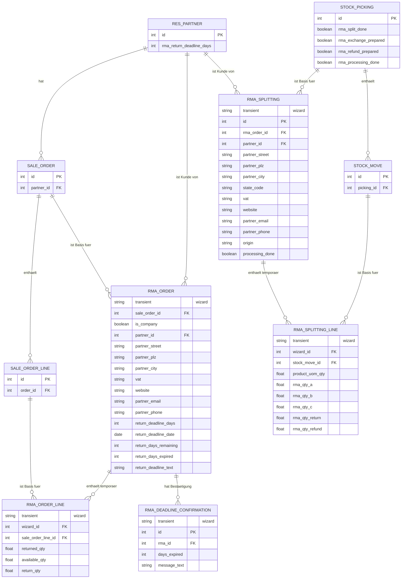

# RMA Management ER-Diagramm

Die Datei kann in Editoren oder Doku-Tools mit Mermaid-Unterstützung direkt als ER-Diagramm gerendert werden.

## Hinweis

Das ER-Diagramm unterscheidet zwischen echten Odoo-Belegen und temporären Wizard-Zeilen. Dauerhaft gespeichert werden im RMA-Prozess nur die Lagerbelege, Lagerbewegungen und Statusinformationen auf dem Lagerbeleg; Eingabemengen der Formulare liegen nur in TransientModels.
